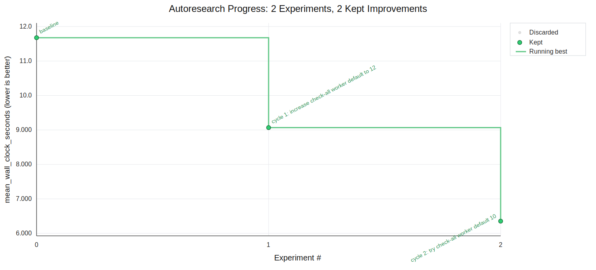

# AutoResearch Report: Speed up check all movies

- Study: `speed-up-check-all-movies`
- Status: `baseline_locked`
- Metric: `mean_wall_clock_seconds` (lower is better)
- Contract hash: `8ce024da65cb6f4e`
- Baseline numeric runs: 1
- Candidate runs: 8
- Decisions: keep=4, discard=4, crash=0
- Incumbent metric: 5.465497
- Incumbent commit: 8fa5d29
- Highlighted session: `session-20260630-065034-aaa6b660` (3 candidate runs)
- Highlighted session mode: `single`, workers: 1

## Hypotheses

| cycle | family | hypothesis | metric | suggested | decision |
| ---: | --- | --- | ---: | --- | --- |
| 1 |  | cycle 1: increase check-all worker default to 12 | 9.06829 | keep | keep |
| 2 |  | cycle 2: try check-all worker default 10 | 6.35363 | keep | keep |
| 3 |  | cycle 3: try check-all worker default 8 | 6.0859 | keep | keep |
| 4 |  | cycle 4: try check-all worker default 6 | 8.20316 | discard | discard |
| 5 |  | cycle 5: try check-all worker default 9 | 9.26535 | discard | discard |
| 6 | early-stop | When RuTracker results are sorted by seeders descending, a page whose maximum seed count is below the item threshold proves later pages cannot pass the seed filter, so pagination can stop without changing accepted results. | 7.75804 | discard | discard |
| 7 | db | Keeping each worker thread's sqlite connection open across its assigned items avoids repeated open/PRAGMA/close overhead while preserving the same per-item writes and final cleanup. | 7.05544 | discard | discard |
| 8 | db | The check-all queue already holds item rows from list_items, so passing those rows into per-item checks avoids redundant item SELECTs while preserving the same queries, filters, writes, and notification behavior. | 5.4655 | keep | keep |

## Recent Runs

| run | session | worker | metric | suggested | exit | description |
| --- | --- | --- | ---: | --- | ---: | --- |
| `20260630-061358-58d8994c` | `session-20260630-061324-b2daabb2` | `` | 9.06829 | keep | 0 | cycle 1: increase check-all worker default to 12 |
| `20260630-061533-0f2eb8b9` | `session-20260630-061324-b2daabb2` | `` | 6.35363 | keep | 0 | cycle 2: try check-all worker default 10 |
| `20260630-061802-23111926` | `session-20260630-061324-b2daabb2` | `` | 6.0859 | keep | 0 | cycle 3: try check-all worker default 8 |
| `20260630-061924-e26ea7a2` | `session-20260630-061324-b2daabb2` | `` | 8.20316 | discard | 0 | cycle 4: try check-all worker default 6 |
| `20260630-062026-148b2e25` | `session-20260630-061324-b2daabb2` | `` | 9.26535 | discard | 0 | cycle 5: try check-all worker default 9 |
| `20260630-065146-80383e82` | `session-20260630-065034-aaa6b660` | `` | 7.75804 | discard | 0 | cycle 6: stop seed-sorted pagination below min seeders |
| `20260630-065324-02c3fd91` | `session-20260630-065034-aaa6b660` | `` | 7.05544 | discard | 0 | cycle 7: reuse check-all worker database connections |
| `20260630-065508-feb18fe4` | `session-20260630-065034-aaa6b660` | `` | 5.4655 | keep | 0 | cycle 8: reuse loaded item rows during check all |

## Recent Decisions

| decision | run | status | description |
| --- | --- | --- | --- |
| `decision-d3d316b9` | `20260630-061358-58d8994c` | keep | cycle 1 kept: worker default 12 improved mean_wall_clock_seconds to 9.068289 |
| `decision-a30203ab` | `20260630-061533-0f2eb8b9` | keep | cycle 2 kept: worker default 10 improved mean_wall_clock_seconds to 6.353633 |
| `decision-0a4ad445` | `20260630-061802-23111926` | keep | cycle 3 kept: worker default 8 improved mean_wall_clock_seconds to 6.085898 |
| `decision-aae47d45` | `20260630-061924-e26ea7a2` | discard | cycle 4 discarded: worker default 6 regressed mean_wall_clock_seconds to 8.203163 |
| `decision-43094bd1` | `20260630-062026-148b2e25` | discard | cycle 5 discarded: worker default 9 regressed mean_wall_clock_seconds to 9.265348 |
| `decision-0eb0c9ca` | `20260630-065146-80383e82` | discard | cycle 6 discarded: seed-sorted pagination stop regressed mean_wall_clock_seconds to 7.758043 |
| `decision-a33f3cf2` | `20260630-065324-02c3fd91` | discard | cycle 7 discarded: worker DB connection reuse regressed mean_wall_clock_seconds to 7.055444 |
| `decision-705762ee` | `20260630-065508-feb18fe4` | keep | cycle 8 kept: reusing loaded item rows improved mean_wall_clock_seconds to 5.465497 |
